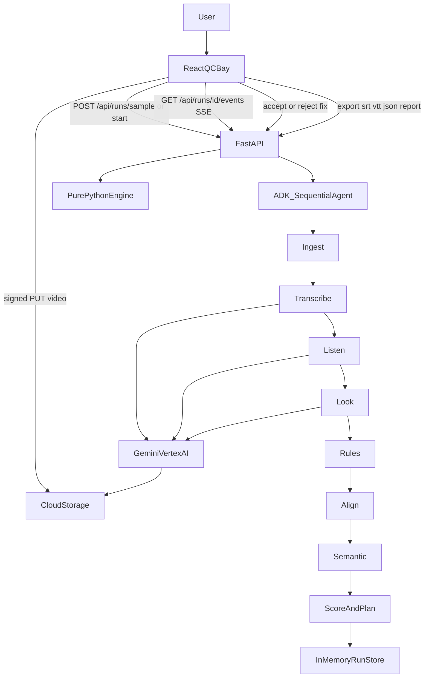
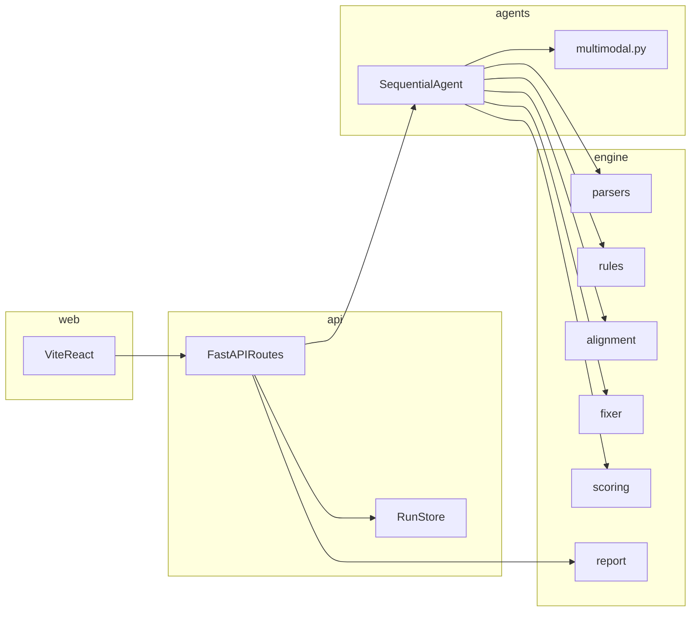

# CueCheck architecture

CueCheck is an accessibility QC bay for timed-text deliverables. A React SPA talks to a FastAPI process. That process runs an eight-step `google-adk` SequentialAgent. Deterministic work lives in `engine/`. Gemini on Vertex AI is used only for Transcribe, Listen, and Look.

Video bytes never enter the app server. The browser uploads picture files to Cloud Storage with a signed PUT URL. Vertex reads the `gs://` URI. Caption and AD files are small text; they may be stored locally when GCS is not configured.

## How a run moves

## Layers

## Pipeline steps

| Step | Kind | Reads | Writes |
|---|---|---|---|
| Ingest | Deterministic | caption URI, AD URI, profile JSON | `Cue` lists |
| Transcribe | Gemini Flash | `gs://` video or recorded fixture | `Segment` list |
| Listen | Gemini Flash | same media | `AudioEvent` list |
| Look | Gemini Pro or Flash | media + segments | on-screen flags, `VisualEvent` list |
| Rules | Deterministic | cues + profile | DUR/CPS/CPL/LINES/GAP/… findings |
| Align | Deterministic | cues + segments | sync, missing dialogue, WER |
| Semantic | Deterministic | model outputs + AD cues | SDH_* and AD_* findings |
| Score and plan | Deterministic | all findings | scorecard + `Fix` proposals |

Thresholds are never hardcoded in the engine. They come from `profiles/adult.json` and `profiles/kids.json`, each value carrying a `source` string.

## Data on disk

- `engine/` — parsers, rules, alignment, fixer, scoring, export, HTML report. No FastAPI or ADK imports.
- `agents/` — SequentialAgent, prompts, Vertex client. `agents/agent.py` exports `root_agent` for `adk web .`
- `api/` — HTTP, SSE, signed URLs, in-memory store. Postgres replaces the store in Phase 6.
- `web/` — New QC, Run (trace, scorecard, timeline, findings, drawer, export), History
- `profiles/` — editable spec numbers
- `samples/` — seeded defective captions and AD script used by **Load sample**
- `tests/fixtures/` — recorded Gemini JSON so the sample runs offline

## Offline vs live

`Load sample` always runs offline against `tests/fixtures/`. Custom runs use Vertex only when `GOOGLE_CLOUD_PROJECT` and `GCS_BUCKET` are set and the picture URI is `gs://`. If a model call fails, that step is marked failed and the UI shows the error. There is no silent fallback to a fixture in a live run.
