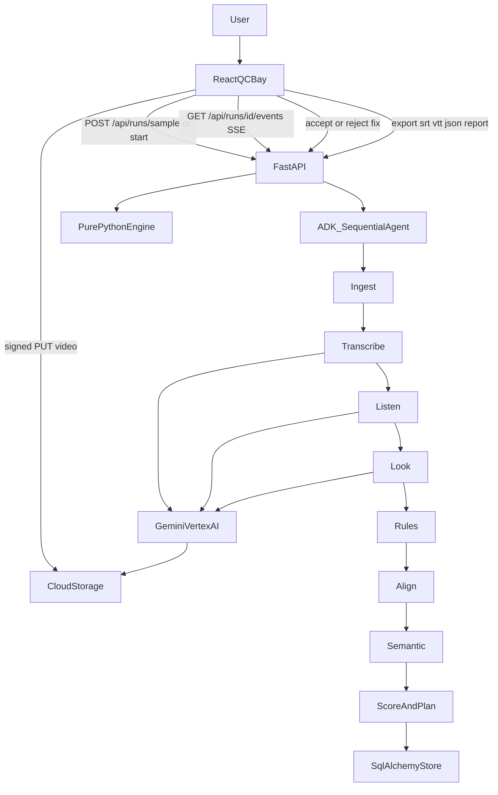
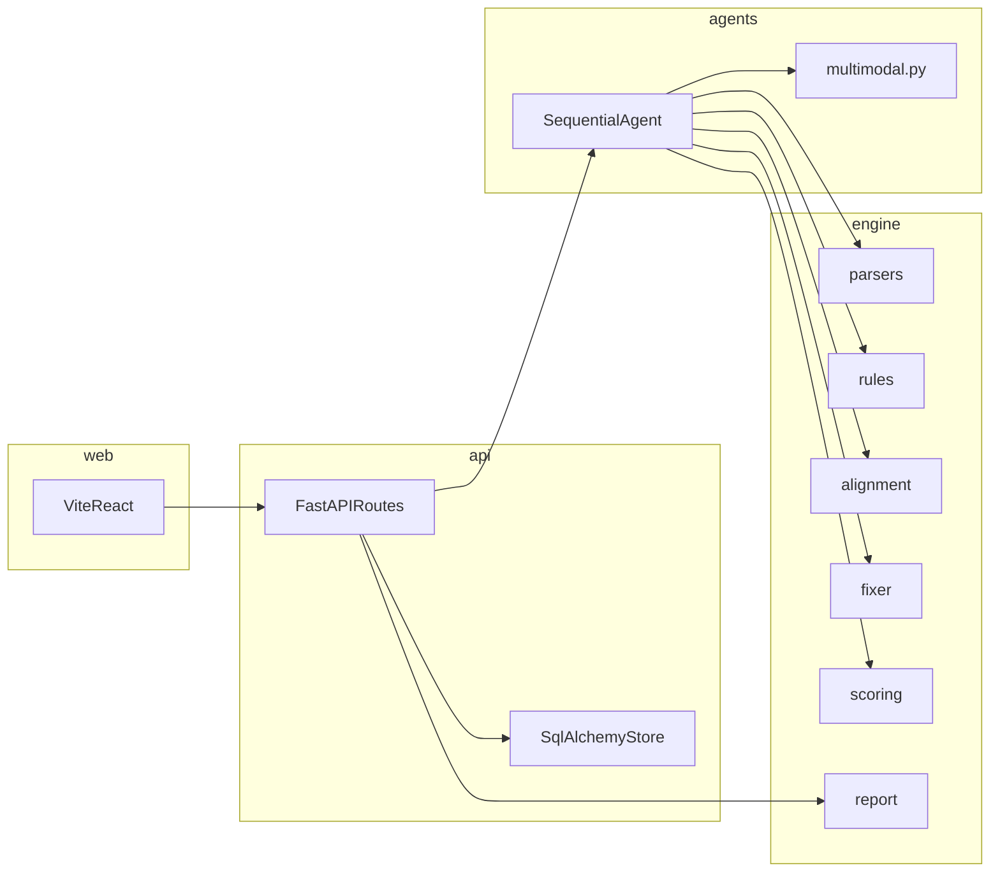

# FrameKind architecture

FrameKind is an accessibility QC bay for timed-text deliverables. A React SPA talks to a FastAPI process. That process runs an eight-step `google-adk` SequentialAgent. Deterministic work lives in `engine/`. Gemini on Vertex AI is used only for Transcribe, Listen, and Look.

With Vertex API-key authentication, the server accepts short video uploads and sends inline media to Gemini. With ADC and Cloud Storage configured, the browser can upload to GCS using a signed PUT URL and Vertex reads the `gs://` URI. Local media belongs to the anonymous browser session that created the run.

## How a run moves

## Layers

## Pipeline steps

| Step | Kind | Reads | Writes |
|---|---|---|---|
| Ingest | Deterministic | caption URI, AD URI, profile JSON | `Cue` lists |
| Transcribe | Gemini Flash | `gs://` video or authored fixture | `Segment` list |
| Listen | Gemini Flash | same media | `AudioEvent` list |
| Look | Gemini Pro or Flash | media + segments | on-screen flags, `VisualEvent` list |
| Rules | Deterministic | cues + profile | DUR/CPS/CPL/LINES/GAP/… findings |
| Align | Deterministic | cues + segments | sync, missing dialogue, WER |
| Semantic | Deterministic | model outputs + AD cues | SDH_* and AD_* findings |
| Score and plan | Deterministic | all findings | scorecard + `Fix` proposals |

Thresholds are never hardcoded in the engine. They come from `profiles/adult.json` and `profiles/kids.json`, each value carrying a `source` string.

## Data on disk

- `engine/` — parsers, rules, alignment, fixer, scoring, export, HTML report. No FastAPI or ADK imports.
- `agents/` — SequentialAgent, prompts, Vertex client. `agents/agent.py` exports `root_agent` for `adk web .`
- `api/` — HTTP, SSE, signed URLs, SQLAlchemy store (`qc_runs`, `qc_findings`, `qc_fixes`, `qc_decisions`). SQLite locally; Postgres on Replit.
- `web/` — New QC, Run (trace, scorecard, timeline, findings, drawer, export), History
- `profiles/` — editable spec numbers
- `samples/` — seeded defective captions and AD script used by **Load sample**
- `tests/fixtures/` — authored sample JSON so the sample runs offline

## Analysis modes

- `sample`: authored transcript, sound and visual fixtures. No live model request.
- `caption_only`: checks the uploaded timed text. Speech accuracy, sound coverage and visual coverage remain unassessed.
- `live`: Gemini analyzes the uploaded media using Vertex API-key authentication or ADC. Model failures stop the run and appear in its trace.

## Repair and session boundaries

Original cues are preserved as a deep snapshot. Approved text and timing repairs compose; incompatible repairs produce a conflict instead of silently dropping an edit. Repeated exports rebuild from the source snapshot. The report escapes untrusted caption and evidence text.

An HTTP-only anonymous session cookie scopes each run, upload, decision and export. This isolates browser sessions; it is not a user-account login or team collaboration system. Clearing the cookie removes access to that browser's earlier runs. SQLite works locally; configure Postgres for durable hosted history.
